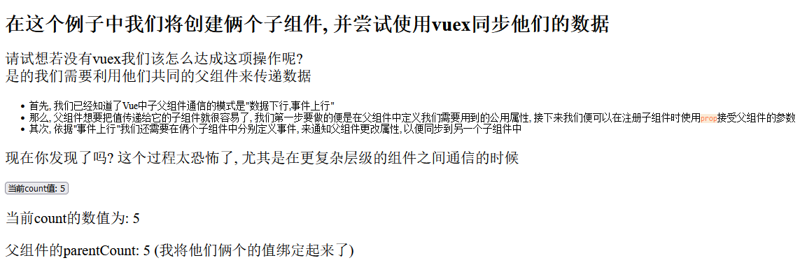

# Vuex使用

## vuex介绍

> vue 是一个专为Vue.js应用程序开发的状态管理模式

| 项目         | 说明                                  |
| ---------- | ----------------------------------- |
| 出发点(解决的问题) | 1. 多层切套传参 2. 全局状态同步                 |
| 采用方式       | 创建一个独立的vue实例来管理全局组件共享的状态            |
| 使用方式       | `<script>`标签中引入, 或使用vue-cli利用node引入 |

这是一个没有vuex情况下的通信

```html
<!DOCTYPE html>
<html lang="en">
<head>
    <meta charset="UTF-8">
    <title>vuex简单使用</title>
    <script src="vue.min.js"></script>
  <style>
    code{
      color: coral;
      background-color: antiquewhite;
    }
    p{
      font-size: 1.5rem;
    }

    #app{

    }
  </style>
</head>
<body>

<h1>
  在这个例子中我们将创建俩个子组件, 并尝试使用vuex同步他们的数据
</h1>
<p>
  请试想若没有vuex我们该怎么达成这项操作呢?
  <br/>
  是的我们需要利用他们共同的父组件来传递数据
</p>
<ul>
  <li>首先, 我们已经知道了Vue中子父组件通信的模式是"数据下行,事件上行"</li>
  <li>那么, 父组件想要把值传递给它的子组件就很容易了, 我们第一步要做的便是在父组件中定义我们需要用到的公用属性, 接下来我们便可以在注册子组件时使用<code>prop</code>接受父组件的参数</li>
  <li>其次, 依据"事件上行"我们还需要在俩个子组件中分别定义事件, 来通知父组件更改属性, 以便同步到另一个子组件中</li>
</ul>

<p>现在你发现了吗? 这个过程太恐怖了, 尤其是在更复杂层级的组件之间通信的时候</p>

<div id="app">
  <jc_button :count="parentCount" @change="changeCount"></jc_button>
  <count_label :count="parentCount"></count_label>
  <p>父组件的parentCount: {{parentCount}} (我将他们俩个的值绑定起来了)</p>
</div>

<script>
  new Vue({
    el:"#app",
    data(){
      return{
        parentCount: 0,
      }
    },
    components:{
      //这里不用短横线连接就显示不出来,不知道为什么
      count_label: {
          template: "<p>当前count的数值为: {{ count }}</p>",
          props: {
            count: Number
          }
      },
      jc_button: {
          template: "<button @click='changeCount'>当前count值: {{ count }}</button>",
          props: {
            count: Number
          },
          methods: {
            changeCount(){
              this.count+=1;
              this.$emit("change", this.count);
            }
          }
      }
    },
    methods:{
      changeCount(value){
        this.parentCount=value;
      }
    }
  })
</script>
</body>
</html>
```

显示效果



## 简单使用

vuex的使用大致分为下面几步:

1. 使用Vue的插件引入函数 use 使用 Vuex `Vue.use(Vuex);`
2. 使用Vuex实例对象的Store方法创建一个store对象 `var store = new Vuex.Store({})`
3. 在vue实例化对象时传入store来使用store

其中Store接受的参数和作用分别为:

```js
var store = new Vuex.Store({
    // 定义数据
    state(){
        return{}
    },
    // 类比计算属性computed
    getters:{},
    // 修改数据(同步)
    mutations:{
      // 里面定义方法, 通过this.$store.emit("方法名", 值)
      // 这里的方法接受俩个参数 store 和 传入的值
    },
    // 修改数据(异步)
    actions:{
      // 异步操作
    },
    modules: {
      // 进一步分装上面的内容
    }
})
```

> 最简单的引入方式就是使用`script`标签引入

```html
<!DOCTYPE html>
<html lang="en">
<head>
    <meta charset="UTF-8">
    <title>vuex简单使用</title>
    <script src="vue.min.js"></script>

    <!--初次尝试, 我们先通过script标签直接引入-->
    <script src="vuex.js"></script>
  <style>
    code{
      color: coral;
      background-color: antiquewhite;
    }
    p{
      font-size: 1.5rem;
    }

    #app, #vuexApp{
      border: 0.2rem solid black;
      padding: 1rem;
      margin-top: 1rem;
    }
  </style>
</head>
<body>

<h1>
  在这个例子中我们将创建俩个子组件, 并尝试使用vuex同步他们的数据
</h1>
<p>
  请试想若没有vuex我们该怎么达成这项操作呢?
  <br/>
  是的我们需要利用他们共同的父组件来传递数据
</p>
<ul>
  <li>首先, 我们已经知道了Vue中子父组件通信的模式是"数据下行,事件上行"</li>
  <li>那么, 父组件想要把值传递给它的子组件就很容易了, 我们第一步要做的便是在父组件中定义我们需要用到的公用属性, 接下来我们便可以在注册子组件时使用<code>prop</code>接受父组件的参数</li>
  <li>其次, 依据"事件上行"我们还需要在俩个子组件中分别定义事件, 来通知父组件更改属性, 以便同步到另一个子组件中</li>
</ul>

<p>现在你发现了吗? 这个过程太恐怖了, 尤其是在更复杂层级的组件之间通信的时候</p>

<div id="app">
  <jc_button :count="parentCount" @change="changeCount"></jc_button>
  <count_label :count="parentCount"></count_label>
  <p>父组件的parentCount: {{parentCount}} (我将他们俩个的值绑定起来了)</p>
</div>

<div id="vuexApp">

  <p>下面是使用vuex的情况</p>
  <jc_button></jc_button>
  <msg></msg>
</div>

<script>
  new Vue({
    el:"#app",
    data(){
      return{
        parentCount: 0,
      }
    },
    components:{
      //这里不用短横线连接就显示不出来,不知道为什么
      count_label: {
          template: "<p>当前count的数值为: {{ count }}</p>",
          props: {
            count: Number
          }
      },
      jc_button: {
          template: "<button @click='changeCount'>当前count值: {{ count }}</button>",
          props: {
            count: Number
          },
          methods: {
            changeCount(){
              this.count+=1;
              this.$emit("change", this.count);
            }
          }
      }
    },
    methods:{
      changeCount(value){
        this.parentCount=value;
      }
    }
  })
</script>

<script>

  // 1. 使用Vue的插件引入函数 use 使用 Vuex
  Vue.use(Vuex);

  // 2. 使用Vuex实例对象的Store方法创建一个store对象
  var store = new Vuex.Store({
    state(){
      // 定义值, 类似data
      return{
        count: 2
      }
    },
    getters:{},
    mutations:{
      // 修改值
      changeCount (state,num){
        state.count += num;
      }
    },
    actions:{
      // 异步操作
    },
    modules: {

    }
  });

  // 3. 使用store
  vueAPP = new Vue({
    el: "#vuexApp",
    store, // 使用store
    components:{
      //这里不用短横线连接就显示不出来,不知道为什么
      msg: {
        template: "<p>当前count的数值为: {{ count }}</p>",
        store,
        data(){
          return {
            count: this.$store.state.count
          }
        },
        watch:{
          '$store.state.count' :{
            handler(newVal,oldVal){
              console.log("值改变了")
              this.count = newVal;
            }}
        }
      },
      jc_button: {
        template: "<button @click='change'>当前count值: {{ count }}</button>",
        store,
        data(){
          return {
            count: this.$store.state.count
          }
        },
        methods: {
          change(){
            this.count += 1
            this.$store.commit("changeCount", 1)
          }
        }
      }
    },
  })

</script>
</body>
</html>
```

## vue-cli使用

上面关于vuex的使用已经很详细了, 采用vue-cli的方式使用时, 只是安装方式和上面有所不同

```js
import { createApp } from 'vue'
import { createStore } from 'vuex'

const store = createStore({
  state () {
    return {
      count: 0
    }
  },
  mutations: {
    increment (state) {
      state.count++
    }
  }
})

const app = createApp({ /* 根组件 */ })

// 将 store 实例作为插件安装
app.use(store)
```

此外cli构建大型项目时, vue官方给出的项目结构建议为

```
├── index.html
├── main.js
├── api
│   └── ... # 抽取出API请求
├── components
│   ├── App.vue
│   └── ...
└── store
    ├── index.js          # 我们组装模块并导出 store 的地方
    ├── actions.js        # 根级别的 action
    ├── mutations.js      # 根级别的 mutation
    └── modules
        ├── cart.js       # 购物车模块
        └── products.js   # 产品模块
```